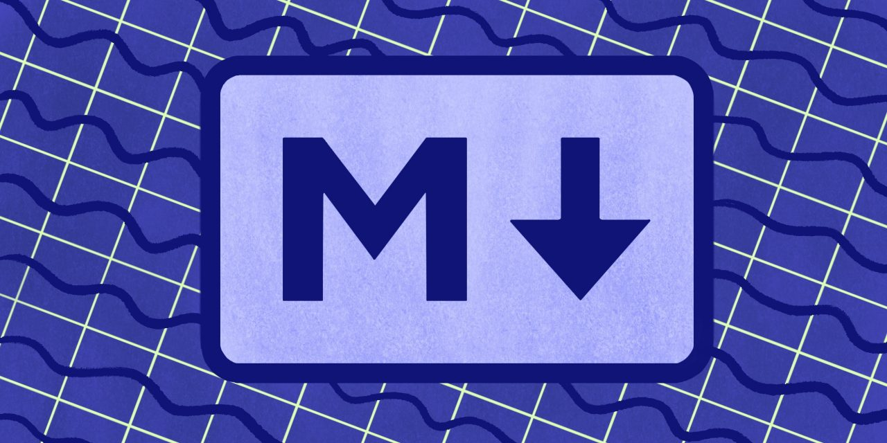

# Основные команды Git
___

* **git init** - *инициализация локального репозитория*
* **git status** - *получить информацию от git о его текущем состоянии*
* **git add** - *добавить файл или файлы к следующему коммиту*
* **git commit** -m "message" - *создание коммита*
* **git log** - *вывод на экран истории всех коммитов с их хеш-кодоми*
* **git checkout** - *переход от одного коммита к другому*
* **git checkout master** - *вернуться к актуальному состоянию и продолжить работу* 
* **git diff** - *увидеть разнецу междутекущем файлом и закоммиченным фыйлом*
* **git clone <url-адрес репозитория>** - клонирование внешнего репозитория на локальный ПК
* **git pull** - получение и слияние с локальной версией
* **git push** - отправляет локальную версию репозитория на внешний
___
___

# Синтаксис языка Markdown
* \# **Заголовок** - *выдиление заголовков. Колличество символов "#" задает заголовка (поддерживается 6 уровней)*
1. \# Пример 
# Пример
2. \## Пример
## Пример
3. \### Пример
### Пример
___
* **= или -** - подчеркиваем этими символами (неменее 3 подрят) первого ("=") и второго ("-") уровней
1. ---

* **\*\*Полужирное начертания\*\*** или __\_\_Полужирное начертание\_\___

* *\*Курсивное начертание\** или _\_Курсирвное начертание\__

* ***\*\*\*Полужирное курсивное начертание\*\*\****
* **~~Зачеркнутый текст~~**
* **\* Строка** - ненумерованные списки, символ "*" в начале строки через пробел
* **1,2,3...** - нумированные списки
1. 1.  Пример
2. 2. Пример
3. 3. Пример   
### ***[Cправочник по Markdown от Microsoft](https://docs.microsoft.com/ru-ru/contribute/markdown-reference)***

# **Спасибо за внимание**
